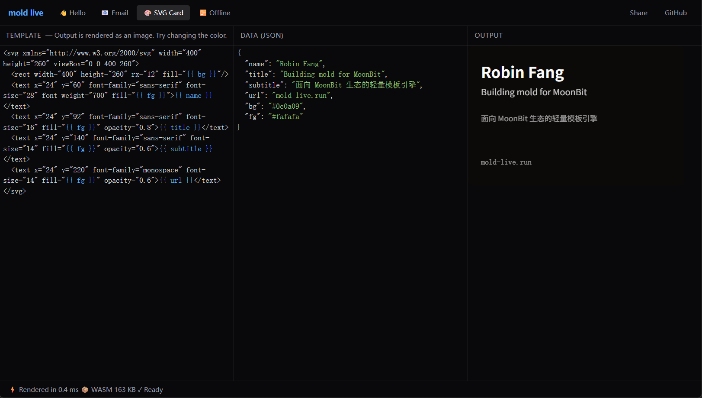
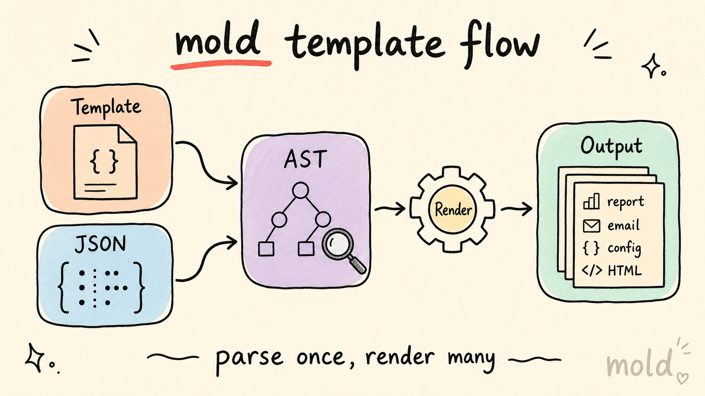

# mold

[](https://github.com/robinfang/mold/actions/workflows/ci.yml)

`mold` 是一个面向 MoonBit 生态的轻量模板引擎。

`mold` is a lightweight template engine for the MoonBit ecosystem.

## 在线体验 / Live Demo

[MoldLive](https://mold-live.run) 是一个在线模板游乐场，`mold` 编译为 WASM 在浏览器中直接运行。你可以在三栏编辑器里修改模板和 JSON 数据，并实时查看输出。

[MoldLive](https://mold-live.run) is an online playground where `mold` runs as WASM directly in your browser. Edit the template and JSON data side by side, then see the rendered output immediately.

[](https://mold-live.run)

- 三栏编辑器：模板 / JSON 数据 / 实时输出
- 4 个内置示例：Hello / Email / SVG Card / Offline Report
- `mold` 语法高亮
- 零后端，模板不离开你的浏览器

## 总体概况 / Overview

`mold` 当前聚焦在一个明确范围内：把模板稳定解析成 AST，再基于统一的 `Value` 模型完成渲染。它优先服务于报告生成、邮件模板、配置文件生成、文档模板这类文本生成场景，同时也支持通过显式配置进入 HTML 输出场景。

`mold` currently focuses on a clear scope: parse templates into ASTs and render them against a unified `Value` model. It primarily targets text generation scenarios such as reports, email templates, config files, and document generation, while also supporting HTML output through explicit configuration.

## 核心链路 / Core Flow

下面这张图概括了 `mold` 的核心链路：模板和 JSON 数据进入解析/诊断流程，再由渲染器产出报告、邮件、配置或 HTML。

The diagram below summarizes the core `mold` flow: templates and JSON data enter parsing and inspection, then rendering produces reports, emails, config files, or HTML.



## 安装 / Installation

```text
moon add robinfang/mold
```

## 30 秒上手 / 30-Second Quick Start

```moonbit
let output = @mold.render(
  "Hello, {{ name }}!",
  @mold.object({ "name": @mold.string("World") }),
)
```

## 推荐使用路径 / Recommended Workflows

这三条路径对应 `mold` 的总体框架：

- 顶层函数：更轻，适合快速渲染
- `Template`：更稳，适合 parse once, render many
- `Engine`：更可扩展，适合 include、autoescape、自定义 filter

These three workflows map directly to the overall structure of `mold`: top-level rendering for quick use, `Template` for repeated rendering, and `Engine` for extensibility.

- 小模板或一次性渲染：`@mold.render(...)`
- 重复渲染同一模板：`Template::parse(...).render(...)`
- 需要 include、autoescape 或自定义 filter：`Engine`

- Use `@mold.render(...)` for small templates or one-off rendering.
- Use `Template::parse(...).render(...)` when the same template is rendered repeatedly.
- Use `Engine` when you need include, autoescape, or custom filters.

## 阅读框架 / Reading Guide

第一次接触 `mold` 时，建议按下面顺序阅读：

1. 先看本页，了解项目定位、安装方式和三种推荐使用路径。
2. 再看 [`docs/getting-started.md`](docs/getting-started.md)，把最小示例和运行方式跑通。
3. 需要写模板时，看 [`docs/template-syntax.md`](docs/template-syntax.md)。
4. 需要多模板组合、HTML 输出或错误排查时，看对应进阶文档和 examples。

When reading `mold` for the first time, start with this page for project scope, installation, and the three recommended workflows, then move to `getting-started`, and finally to `template-syntax` when you begin writing templates.

## 文档导航 / Documentation

- 文档首页 / Docs index: [`docs/index.md`](docs/index.md)
- 快速开始 / Getting started: [`docs/getting-started.md`](docs/getting-started.md)
- 模板语法 / Template syntax: [`docs/template-syntax.md`](docs/template-syntax.md)
- Engine 指南 / Engine guide: [`docs/engine-guide.md`](docs/engine-guide.md)
- 模板诊断 / Inspection: [`docs/inspection.md`](docs/inspection.md)
- HTML 安全 / HTML safety: [`docs/html-safety.md`](docs/html-safety.md)
- 错误排查 / Errors: [`docs/errors.md`](docs/errors.md)
- WASM 导出 / WASM export: [`docs/wasm-export.md`](docs/wasm-export.md)
- 形式化验证 / Proof sandbox: [`docs/scope-proof.md`](docs/scope-proof.md)
- Recipes / Recipes:
  - [`docs/recipes/report-generation.md`](docs/recipes/report-generation.md)
  - [`docs/recipes/email-template.md`](docs/recipes/email-template.md)
  - [`docs/recipes/include-loader.md`](docs/recipes/include-loader.md)
  - [`docs/recipes/json-input.md`](docs/recipes/json-input.md)
  - [`docs/recipes/site-generation.md`](docs/recipes/site-generation.md)

## 示例 / Examples

- `src/examples/hello/`
  - 最小变量插值与 filter
  - Minimal interpolation and filters
- `src/examples/report/`
  - 循环、条件分支与嵌套对象
  - Loops, conditionals, and nested objects
- `src/examples/email/`
  - 更接近真实业务的文本模板
  - A more realistic text template
- `src/examples/include_loader/`
  - `Engine + Loader + include` 的模板组合
  - Template composition with `Engine + Loader + include`
- `src/examples/html_safe/`
  - `with_autoescape(true)` 与 `| safe`
  - `with_autoescape(true)` and `| safe`
- `src/examples/custom_filter/`
  - `Engine::register_filter(...)` 自定义 filter
  - Custom filters via `Engine::register_filter(...)`
- `src/examples/from_json/`
  - `from_json(...)` 把 JSON 转成模板上下文
  - Convert JSON into template context with `from_json(...)`
- `src/examples/site/`
  - 静态网站批量渲染
  - Static site batch rendering

运行示例 / Run an example:

```text
moon run src/examples/hello
moon run src/examples/include_loader
moon run src/examples/html_safe
moon run src/examples/custom_filter
moon run src/examples/from_json
```

## 能力摘要 / Feature Summary

- 纯文本渲染 / plain text rendering
- `{{ expr }}` 插值与点路径访问 / interpolation with dotted lookup
- `` / `` / `` 条件分支 / conditional blocks
- `` / `` 循环，支持嵌套控制块 / loops with nested control blocks
- 内置 filters / built-in filters:
  - `upper`
  - `lower`
  - `trim`
  - `default(...)`
  - `join(...)`
  - `escape`
  - `length`
  - `safe`
- 比较与布尔表达式 / comparison and boolean expressions:
  - `== != < <= > >=`
  - `and or not`
  - parentheses grouping
- `` 模板包含 / template inclusion
- whitespace control / 空白控制：`` 和 `{{-` / `-}}`
- `{# ... #}` 模板注释 / template comments
- Engine 级 autoescape / engine-level autoescape
- `Template::ast()` 调试访问 / AST debug accessor
- `Template::inspect()` / `inspect(...)` 模板依赖诊断 / template dependency inspection
- `from_json` / `from_map` 上下文转换 / context conversion helpers
- 结构化错误类型与源码位置 / structured errors with source spans

## HTML 安全 / HTML Safety

默认情况下，`mold` 不自动转义 HTML，适合通用文本生成场景。输出 HTML 时，建议显式使用 `Engine::with_autoescape(true)`。

By default, `mold` does not autoescape HTML, which keeps it suitable for general text generation. For HTML output, explicitly enable `Engine::with_autoescape(true)`.

```moonbit
let engine = @mold.Engine::new().with_autoescape(true)

let output = engine.render(
  "{{ user_input }} | {{ trusted_html | safe }}",
  @mold.object({
    "user_input": @mold.string("<strong>escaped</strong>"),
    "trusted_html": @mold.string("<em>kept</em>"),
  }),
)
```

## API 摘要 / API Snapshot

```moonbit
pub fn render(source : String, ctx : Value) -> String raise MoldError

pub fn Template::parse(source : String) -> Template raise MoldError
pub fn Template::render(self : Template, ctx : Value) -> String raise MoldError
pub fn Template::source(self : Template) -> String
pub fn Template::ast(self : Template) -> Array[Node]
pub fn Template::inspect(self : Template) -> TemplateInspection

pub fn Engine::new() -> Engine
pub fn Engine::with_loader(self : Engine, loader : Loader) -> Engine
pub fn Engine::with_autoescape(self : Engine, autoescape : Bool) -> Engine
pub fn Engine::register_filter(self : Engine, name : String, filter : Filter) -> Unit raise MoldError
pub fn Engine::parse(self : Engine, source : String) -> Template raise MoldError
pub fn Engine::render(self : Engine, source : String, ctx : Value) -> String raise MoldError
pub fn Engine::inspect(self : Engine, source : String) -> TemplateInspection raise MoldError

pub fn inspect(source : String) -> TemplateInspection raise MoldError
```

## 当前限制 / Current Limits

- 不支持模板继承 / no template inheritance
- 不支持宏系统 / no macro system
- 不支持异步模板 / no async templates
- 不支持自动模板目录扫描 / no automatic template discovery

## 仓库链接 / Repository Links

- GitHub: <https://github.com/robinfang/mold>
- GitLink: <https://www.gitlink.org.cn/robinfang/mold>

## 发布状态 / Release Status

`mold` 已发布到 `mooncakes.io`，当前版本为 `0.3.0`。

`mold` is now published on `mooncakes.io`, and the current version is `0.3.0`.

## 开源协议 / License

Apache-2.0
